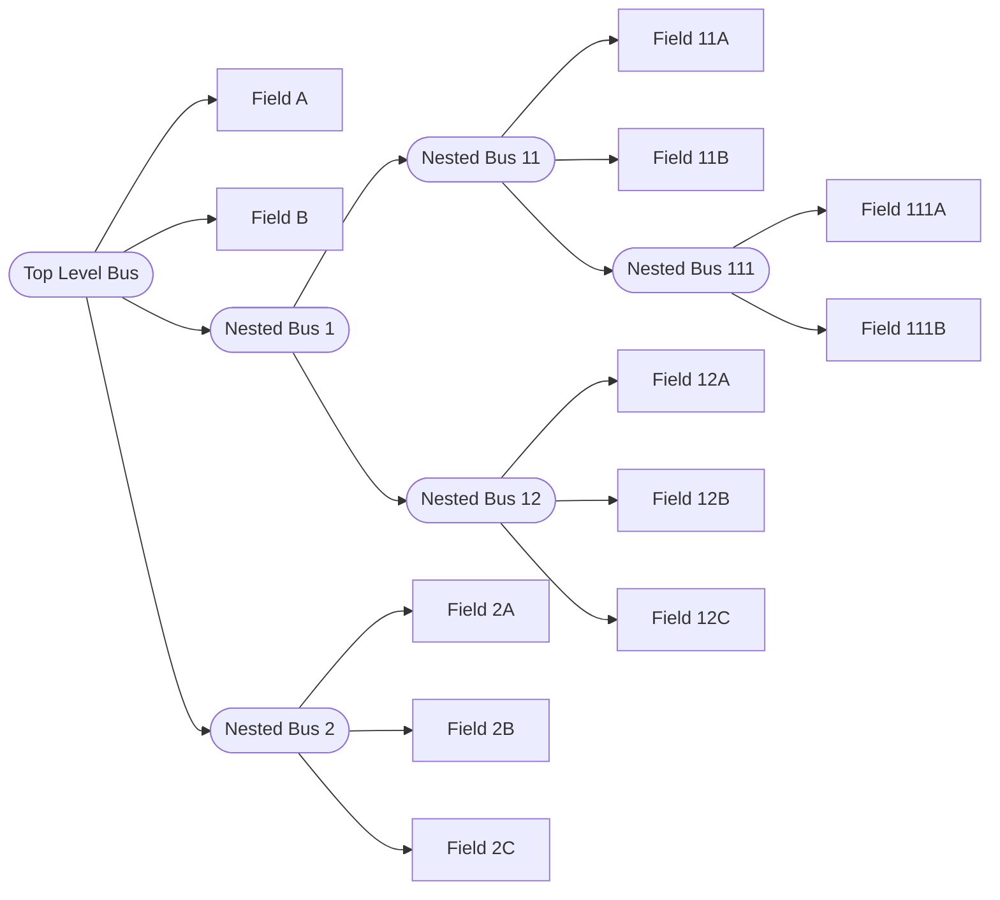

# Buses Configuration
{: .no_toc }
The subsystem functions called in the Simulink model generally output variables of MATLAB's `struct` type.
The corresponding type of signal that Simulink uses to route the data between subsystems is called _bus_.
Since the user can freely define what data to write into the output structures of the subsystem functions, the buses can be different for every simulation.
Simulink unfortunately cannot automatically infer the necessary format of a bus from the MATLAB function block which is why the user has to manually provide objects of the MATLAB's class `Simulink.Bus` for every bus signal within the simulink model.
This page explains how that is done in SADYCOS.

## Page contents
{: .no_toc .text-delta }
- TOC
{:toc}

## Top-Level Buses
The following is a list of buses used directly in SADYCOS' Simulink model ordered by the subsystem that outputs them:
- Subsystem `Environment`
    - `EnvironmentConditions`
    - `EnvironmentStates`
    - `LogEnvironment`
- Subsystem `Plant`
    - `PlantOutputs`
    - `PlantFeedthrough`
    - `PlantStates`
    - `LogPlantDynamics`
    - `LogPlantOutput`
- Subsystem `Sensors`
    - `SensorsOutputs`
    - `SensorsStates`
    - `LogSensors`
- Subsystem `Actuators`
    - `ActuatorsOutputs`
    - `ActuatorsStates`
    - `LogActuators`
- Subsystem `GncAlgorithms`
    - `GncAlgorithmsStates`
    - `ActuatorsCommands`
    - `LogGncAlgorithms`

## Simulink Bus Class
Simulink must have access to the definition of a bus signal to know its format.
This can be achieved by instantiating objects of MATLAB's class `Simulink.Bus` in a workspace that the Simulink model has access to.
One property of this class is `Elements` which is an array of objects of another class `Simulink.BusElement`.
Storing multiple objects in this property is used to represent data of the `struct` type.
E.g., a structure with three fields `a`, `b`, and `c` can be represented by a `Simulink.Bus` object with three corresponding `Simulink.BusElement` objects in its `Elements` property.
The `Simulink.BusElement` class has multiple properties that Simulink uses to determine the format of the bus signal.
The most important ones are:
- `Name`: the name that is used to access the field
- `Dimensions`: the size of the field
- `DataType`: the data type of the field

For the last one, it is important to note that Simulink uses data types that are different from MATLAB's data types.
E.g., while MATLAB defines the type `logical` for data that can either be `true` or `false`, Simulink's corresponding data type is called `boolean`.

Just like structure fields can themselves also be structures, a bus element can also be a bus.
Unfortunately, this means for a more complex bus that the user has to create a `Simulink.Bus` object for the top-level bus and every nested bus within it.
The following example shows such a signal hierarchy:


For this bus, the user would have to create six objects in total:
- `Top-Level Bus`,
- `Nested Bus 1`,
- `Nested Bus 11`,
- `Nested Bus 111`,
- `Nested Bus 12`, and
- `Nested Bus 2`,

each of which must contain the corresponding array of `Simulink.BusElement` objects in its `Elements` property.

## Process
Right after the constructor of the configuration class has finished executing the static method `configureParameters`, it calls the method `configureBuses` with the cell array of parameters as an input argument.
This method must be implemented by the user and output a structure with a list of `Simulink.Bus` objects that are used in the Simulink model and template structures for each top-level bus.

## List of Buses
The creation of these bus objects is done in the configuration class' static method `configureBuses` which is called by the constructor of the configuration class right after `configureParameters` has been executed (see [Parameter Configuration]()).
SADYCOS supports the user in this task by providing the utility class `BusesInfoCreator`.
The following excerpt from the `DefaultConfiguration` class in the `ExamplesMission` namespace shows how to use this class:

{: .code_block }
> <details closed markdown="block">
> <summary>configureBuses.m</summary>
> ```matlab
> %% Use helper class
> import BusesInfoCreator.simpleBusElement
> 
> ...
> 
> %% EnvironmentConditions
> 
> % Nested Buses
> 
> % Time
> elems = simpleBusElement('current_time__mjd', 1, 'double');
> 
> busesInfoCreator.setBusByElements('Time', elems);
> 
> % Earth Atmosphere
> elems = [simpleBusElement('mass_density__kg_per_m3', 1), ...
>             simpleBusElement('number_density__1_per_m3', 1), ...
>             simpleBusElement('temperature__K', 1)];
> 
> busesInfoCreator.setBusByElements('EarthAtmosphere', elems);
> 
> % Earth Gravitational Field
> elems = simpleBusElement('gravitational_acceleration_I__m_per_s2', 3);
> 
> busesInfoCreator.setBusByElements('EarthGravitationalField', elems);
> 
> % Earth Magnetic Field
> elems = simpleBusElement('magnetic_field_I__T', 3);
> 
> busesInfoCreator.setBusByElements('EarthMagneticField', elems);
> 
> % Earth Rotation
> elems = simpleBusElement('earth_quaternion_EI', 4);
> 
> busesInfoCreator.setBusByElements('EarthRotation', elems);
> 
> % Top-Level Bus
> 
> elems = [simpleBusElement('Time', 1, 'Bus: Time'), ...
>             simpleBusElement('EarthAtmosphere', 1, 'Bus: EarthAtmosphere'), ...
>             simpleBusElement('EarthGravitationalField', 1, 'Bus: EarthGravitationalField'), ...
>             simpleBusElement('EarthMagneticField', 1, 'Bus: EarthMagneticField'), ...
>             simpleBusElement('EarthRotation', 1, 'Bus: EarthRotation')];
> 
> busesInfoCreator.setBusByElements('EnvironmentConditions', elems);
> ```
> </details>

In this example, the bus `EnvironmentConditions` is created with five fields `Time`, `EarthAtmosphere`, `EarthGravitationalField`, `EarthMagneticField`, and `EarthRotation`.
Each of these fields is itself a nested bus which corresponds to a `Simulink.Bus` object that has to be created in the same way.

The utility class `BusesInfoCreator` provides a static method `simpleBusElement` that simplifies the creation of `Simulink.BusElement` objects by only requiring the name and dimensions and optionally the data type and complexity of the element.
After assembling a list of those objects (called `elems` in the above example), the user can call the method `setBusByElements` of the `BusesInfoCreator` instance to add a new `Simulink.Bus` object to the list of buses.
The method checks under the hood whether the same bus has already been created, avoiding duplicates.
This is done for every nested bus and finally for the top-level bus `EnvironmentConditions`.
Its fields are the nested buses whose data types must be set to a string of the format `Bus: BusName` where `BusName` is the name of the corresponding nested bus.
This procedure is subsequently repeated for the remaining top-level buses (not shown in the above excerpt).

At the very end, the method `getBusesInfo` of the `BusesInfoCreator` instance is called which checks whether all necessary top-level and nested bus have been set before outputting a structure called `BusesInfo`.
This structure contains a field `buses_list` which is the list of bus objects (and their names) that was created with the helper class.
The entire structure `BusesInfo` must be returned by the `configureBuses` method because it is used in the subsequent step of the configuration class' constructor where it is stored inside the simulation run's own workspace (see [Simulation Input Configuration]()), avoiding cluttering up the MATLAB workspace.

Similarly to the parameters, running multiple simulations with the same configuration class demands that an _array_ of `BusesInfo` structures instead of a single structure is returned by the `configureBuses` method.

## Bus Templates
Apart from the list of bus objects, the `BusesInfo` structure also contains a field `BusTemplates` whose importance has not been explained yet.
It is a structure that holds default values of all top-level buses.
Its necessity arises from a quirk in the interplay between Simulink and MATLAB functions because the order in which the fields of a structure were created matters.

Let us assume that one of the MATLAB function blocks has an output for which a bus object was created that has fields `a` and `b` in that order.
If the MATLAB function block creates a structure and assigns a value to the field `b` before the field `a` and then attempts to assign this structure to the output, Simulink will throw an error.

SADYCOS wants to avoid forcing the user to pay attention to the order in which structure fields are assigned in the subsystem functions.
This is achieved by automatically creating said templates of the bus structures from the bus object definitions that are guaranteed to have fields in the same order as the bus objects.
These templates are used to initialize the outputs of the MATLAB function blocks.
This happens as part of the boilerplate code within the MATLAB function block before the call to the actual subsystem function is made.
So, the user does not come into contact with this issue except for the fact that all subsystem functions must accept their output structures as inputs as well.
Due to this, the output structures already have the correct order of fields within those subsystem functions and it does not matter when the user assigns new values to them.