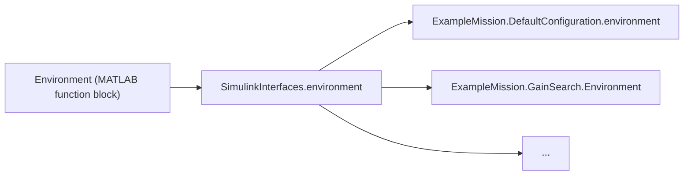

# Subsystem Functions
{: .no_toc }
The main Simulink model `sadycos.slx` only provides the general structure of the simulation by defining the five main subsystems `Environment`, `Plant`, `Sensors`, `Actuators` and `GNC Algorithms`.
Each of these subsystems contains one MATLAB function block (in case of the `Plant` subsystem, there are two) which is responsible for calling the actual subsystem function. 

## Page Contents
{: .no_toc .text-delta }

- TOC
{:toc}

## Function Call Hierarchy
The MATLAB function block only performs some boilerplate tasks like preparing inputs and outputs before calling the actual subsystem function.
For example, the content of the MATLAB function block in the `Environment` subsystem is as follows:

```matlab
function [EnvironmentConditions, ...
            LogEnvironment, ...
            EnvironmentStatesDerivatives] ...
            = Environment(PlantOutputs, ...
                            simulation_time__s, ...
                            EnvironmentStates, ...
                            Parameters, ...
                            BusTemplates)

%% Parameters Abbreviations
ParametersEnvironment = Parameters.Environment;

%% Initialize Bus Outputs
EnvironmentConditions = BusTemplates.EnvironmentConditions;
LogEnvironment = BusTemplates.LogEnvironment;
EnvironmentStatesDerivatives = BusTemplates.EnvironmentStates;

%% Call Function
[EnvironmentConditions, ...
    LogEnvironment, ...
    EnvironmentStatesDerivatives] ...
    = SimulinkInterfaces.environment(EnvironmentConditions, ...
                                        LogEnvironment, ...
                                        EnvironmentStatesDerivatives, ...
                                        PlantOutputs, ...
                                        simulation_time__s, ...
                                        EnvironmentStates, ...
                                        ParametersEnvironment);
end
```

The actual function that is called is `environment` within the `SimulinkInterfaces` namespace.
This namespace and its function files is located in the `AutoGenerated` folder in the root directory of the project.
As the folder's name suggests, these functions are automatically generated before a simulation is run.
Therefore, the folder will initially be empty after cloning the repository and before executing the first simulation.

The reason why SADYCOS relies on automatically generating these function files is that a Simulink model apparently cannot be told through parameters or workspace variables which function to call in a MATLAB function block.
Therefore, in order to execute different functions from the same MATLAB function block, they must call functions from a constant namespace whose content is replaced before the simulation is run.

All the automatically generated functions do is to call the actual subsystem functions from the correct configuration class.
The function call hierarchy is illustrated in the following diagram:


The automatically generated functions call the static methods of the configuration class that is responsible for their creation.

## Implementation
The user should never have to interact with the automatically generated functions directly.
You are only responsible for creating the corresponding static methods within the configuration classes.
This is where the actual behavior of the system (i.e. the functions $$f$$ and $$h$$, see [Modelling Dynamic Systems]()) is defined.
A good example is the method `plantDynamics` of the `DefaultConfiguration` class in the `ExampleMission` namespace.
Its code can be seen in full by opening the following code block:
<details closed markdown="block">
<summary>Code Block: plantsDynamics.m</summary>
```matlab
function [PlantFeedthrough, ...
            LogPlantDynamics, ...    
            PlantStatesDerivatives] ...
            = plantDynamics(PlantFeedthrough, ...
                                LogPlantDynamics, ...
                                PlantStatesDerivatives, ...
                                EnvironmentConditions, ...
                                ActuatorsOutputs, ...
                                PlantStates, ...
                                ParametersPlant)

%% Abbreviations

% States
velocity_BI_I__m_per_s = PlantStates.RigidBody.velocity_BI_I__m_per_s;
attitude_quaternion_BI = PlantStates.RigidBody.attitude_quaternion_BI;
angular_velocity_BI_B__rad_per_s = PlantStates.RigidBody.angular_velocity_BI_B__rad_per_s;
rw_angular_velocities__rad_per_s = PlantStates.ReactionWheels.angular_velocities__rad_per_s;

% Environment Conditions
gravitational_acceleration_I__m_per_s2 = EnvironmentConditions.EarthGravitationalField.gravitational_acceleration_I__m_per_s2;
atmosphere_mass_density__kg_per_m3 = EnvironmentConditions.EarthAtmosphere.mass_density__kg_per_m3;
atmosphere_number_density__1_per_m3 = EnvironmentConditions.EarthAtmosphere.number_density__1_per_m3;
atmosphere_temperature__K = EnvironmentConditions.EarthAtmosphere.temperature__K;
magnetic_field_I__T = EnvironmentConditions.EarthMagneticField.magnetic_field_I__T;

% Actuators
magnetic_dipole_moment_B__A_m2 = ActuatorsOutputs.MagneticTorquers.magnetic_dipole_moment_B__A_m2;
rw_torque_commands__N_m = ActuatorsOutputs.ReactionWheels.torque_commands__N_m;

%% Forces and Torques

% Gravity
gravitational_force_I__N = PointMassGravity.execute(gravitational_acceleration_I__m_per_s2, ...
                                                                ParametersPlant.PointMassGravity);

% Aerodynamics
[aerodynamic_force_B__N, aerodynamic_torque_B_B__Nm] ...
    = SimplifiedVleoAerodynamics.execute(attitude_quaternion_BI, ...
                                            angular_velocity_BI_B__rad_per_s, ...
                                            velocity_BI_I__m_per_s, ...
                                            zeros(3,1), ...
                                            atmosphere_mass_density__kg_per_m3, ...
                                            atmosphere_number_density__1_per_m3, ...
                                            atmosphere_temperature__K, ...
                                            zeros(5,1), ...
                                            ParametersPlant.SimplifiedVleoAerodynamics);
aerodynamic_force_I__N = smu.unitQuat.att.transformVector(smu.unitQuat.invert(attitude_quaternion_BI), aerodynamic_force_B__N);

% Magnetics
magnetic_field_B__T = smu.unitQuat.att.transformVector(attitude_quaternion_BI, magnetic_field_I__T);
magnetic_torque_B_B__N_m = MagneticDipoleTorque.execute(magnetic_dipole_moment_B__A_m2, ...
                                                        magnetic_field_B__T);

% Reaction Wheel Array
[rw_angular_velocities_derivative__rad_per_s2, ...
    reaction_torque_B_B__N_m, ...
    gyroscopic_torque_B_B__N_m] ...
    = RateLimitedReactionWheels.execute(rw_torque_commands__N_m, ...
                                        angular_velocity_BI_B__rad_per_s, ...
                                        rw_angular_velocities__rad_per_s, ...
                                        ParametersPlant.RateLimitedReactionWheels);

%% Sum forces and torques
net_force_I__N = gravitational_force_I__N + aerodynamic_force_I__N;
net_torque_B_B__N_m = aerodynamic_torque_B_B__Nm + magnetic_torque_B_B__N_m + reaction_torque_B_B__N_m + gyroscopic_torque_B_B__N_m;

%% Mechanics
% Rigid Body
[position_derivative_BI_I__m_per_s, ...
    velocity_derivative_BI_I__m_per_s2, ...
    attitude_quaternion_derivative__1_per_s, ...
    angular_velocity_derivative_BI_B__rad_per_s2] ...
    = RigidBodyMechanics.execute(net_force_I__N, ...
                                    net_torque_B_B__N_m, ...
                                    velocity_BI_I__m_per_s, ...
                                    attitude_quaternion_BI, ...
                                    angular_velocity_BI_B__rad_per_s, ...
                                    ParametersPlant.RigidBodyMechanics);

%% Feedthrough Output
PlantFeedthrough.RigidBodyAccelerations.acceleration_BI_I__m_per_s2 = velocity_derivative_BI_I__m_per_s2;
PlantFeedthrough.RigidBodyAccelerations.rotational_acceleration_BI_B__rad_per_s2 = angular_velocity_derivative_BI_B__rad_per_s2;

%% States Derivatives
PlantStatesDerivatives.RigidBody.position_BI_I__m = position_derivative_BI_I__m_per_s;
PlantStatesDerivatives.RigidBody.velocity_BI_I__m_per_s = velocity_derivative_BI_I__m_per_s2;
PlantStatesDerivatives.RigidBody.attitude_quaternion_BI = attitude_quaternion_derivative__1_per_s;
PlantStatesDerivatives.RigidBody.angular_velocity_BI_B__rad_per_s = angular_velocity_derivative_BI_B__rad_per_s2;
PlantStatesDerivatives.ReactionWheels.angular_velocities__rad_per_s = rw_angular_velocities_derivative__rad_per_s2;

%% Log relevant data
LogPlantDynamics.PlantFeedthrough = PlantFeedthrough;
LogPlantDynamics.PlantStatesDerivatives = PlantStatesDerivatives;
LogPlantDynamics.PlantStates = PlantStates;
LogPlantDynamics.Forces.net_force_I__N = net_force_I__N;
LogPlantDynamics.Forces.gravitational_force_I__N = gravitational_force_I__N;
LogPlantDynamics.Forces.aerodynamic_force_B__N = aerodynamic_force_B__N;
LogPlantDynamics.Torques.net_torque_B_B__N_m = net_torque_B_B__N_m;
LogPlantDynamics.Torques.aerodynamic_torque_B_B__Nm = aerodynamic_torque_B_B__Nm;
LogPlantDynamics.Torques.magnetic_torque_B_B__N_m = magnetic_torque_B_B__N_m;
LogPlantDynamics.Torques.reaction_torque_B_B__N_m = reaction_torque_B_B__N_m;
LogPlantDynamics.Torques.gyroscopic_torque_B_B__N_m = gyroscopic_torque_B_B__N_m;

end
```
</details>

It can be seen that this function is structured in the following way:
1. Extract inputs
2. Calculate Forces and Torques
3. Calculate States Derivatives
4. Populate Outputs

The most important parts are steps 2 and 3.
This is where the actual physics of the system is implemented by calling the execute methods of the models.
E.g., the gravitational force is calculated with the call `PointMassGravity.execute` and the derivatives of the mechanical states are calculated with the call `RigidBodyMechanics.execute`.
Some of the outputs of these methods might need to be edited before being passed on to the next model.
E.g., the aerodynamic force is transformed into the inertial frame before being added to the net force.

In step 4, the results of the models are then written to the output structures of the function.
This particular subsystem function has three outputs: `PlantFeedthrough`, `PlantStatesDerivatives`, and `LogPlantDynamics`.
The `PlantFeedthrough` structure is used to pass (improper output) data from the `Plant` subsystem to the `Sensors` subsystem.
So, it contains data that is in some way relevant for the sensors like the translational and rotational accelerations of the satellite in this example. 
The `PlantStatesDerivatives` structure contains the derivatives of the states of the `Plant` subsystem.
Its fields will be passed through an integrator and the result is fed back into this function as the `PlantStates` input.
The `LogPlantDynamics` structure is used to store data for post-processing and debugging purposes.

The implementations of the other subsystem functions are structured in a similar way.
The example configurations in the `ExampleMission` namespace provide a good starting point for creating your own configuration classes.